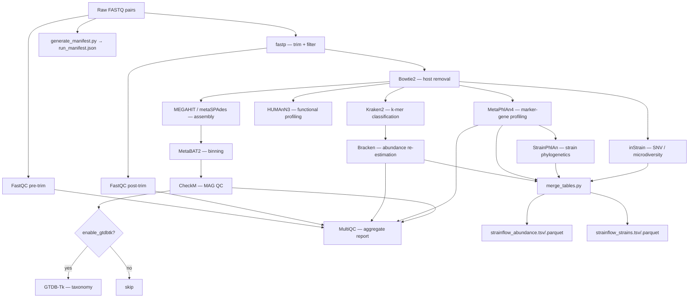

# StrainFlow

> **Strain-resolved shotgun metagenomics, from raw reads to publication-ready tables — in one command.**

[](https://github.com/xX-its-amit-Xx/StrainFlow/actions/workflows/ci.yml)
[](LICENSE)
[](https://www.nextflow.io/)
[](https://www.docker.com/)

---

## What & why

StrainFlow is an end-to-end Nextflow DSL2 pipeline that takes paired-end shotgun
metagenomics FASTQ files and produces clean, analysis-ready abundance tables,
strain-level phylogenetic trees, metagenome-assembled genomes (MAGs), and functional
pathway profiles — all in a single reproducible run. It was designed with three goals:

1. **Strain resolution as a first-class feature.** Standard metagenomic tools report
   species abundances. StrainFlow goes further: StrainPhlAn builds per-clade phylogenetic
   trees from marker genes, and inStrain quantifies within-host SNV diversity at the
   read level. This matters in clinical and evolutionary contexts where knowing *which*
   strain of *Staphylococcus aureus* is present changes the biological interpretation.

2. **Reproducibility without friction.** Every tool is pinned to a versioned Docker image.
   A JSON run manifest captures tool versions, parameters, and git commit with every run.
   A `params.yaml` + `nextflow_schema.json` pair documents and validates all inputs.

3. **Cloud-native cost-awareness.** The `aws` profile uses Spot instances with retry-on-reclaim
   for interruptible workloads and falls back to On-Demand only for xlarge MAG steps.
   Per-process resource labels (small / medium / large / xlarge) keep costs predictable.

---

## Pipeline DAG



---

## Quick start

### Prerequisites

- [Nextflow](https://www.nextflow.io/) ≥ 23.10.0
- [Docker](https://docs.docker.com/get-docker/) (for `local` profile)
- Java 11+ (required by Nextflow)

### Local run

```bash
# Clone the repo
git clone https://github.com/xX-its-amit-Xx/StrainFlow.git
cd StrainFlow

# Create your samplesheet (CSV with columns: sample, fastq_1, fastq_2)
cat > samplesheet.csv <<EOF
sample,fastq_1,fastq_2
sample_01,/data/sample_01_R1.fastq.gz,/data/sample_01_R2.fastq.gz
sample_02,/data/sample_02_R1.fastq.gz,/data/sample_02_R2.fastq.gz
EOF

# Copy and edit params
cp params.yaml my_params.yaml
# Edit my_params.yaml — set database paths

# Run
nextflow run . \
    -profile local \
    --input samplesheet.csv \
    --outdir results \
    -params-file my_params.yaml
```

### AWS Batch run

```bash
# Set your S3 bucket
export NXF_S3_BUCKET=my-strainflow-work-bucket

# Upload samplesheet and FASTQs to S3
aws s3 cp samplesheet.csv s3://my-data-bucket/samplesheet.csv

# Run on AWS Batch (costs ~$8–15 per sample on Spot, depending on depth)
nextflow run xX-its-amit-Xx/StrainFlow \
    -r v1.0.0 \
    -profile aws \
    --input s3://my-data-bucket/samplesheet.csv \
    --outdir s3://my-data-bucket/results \
    -params-file my_params.yaml \
    -with-report report.html \
    -with-timeline timeline.html
```

### Test run (CI / validation)

```bash
nextflow run . -profile test,local
```

---

## Inputs & outputs

### Inputs

| Parameter | Type | Default | Description |
|-----------|------|---------|-------------|
| `--input` | CSV | **required** | Samplesheet (columns: `sample`, `fastq_1`, `fastq_2`) |
| `--outdir` | path | `results` | Output directory (local path or `s3://...`) |
| `--host_index` | path | GRCh38 | Bowtie2 index prefix for host genome |
| `--kraken2_db` | path | — | Kraken2 database directory |
| `--metaphlan_db` | path | — | MetaPhlAn4 SGB marker database |
| `--instrain_db` | path | — | inStrain reference genome database |
| `--humann3_nt_db` | path | — | HUMAnN3 ChocoPhlAn nucleotide DB |
| `--humann3_prot_db` | path | — | HUMAnN3 UniRef90 protein DB |
| `--assembler` | string | `megahit` | `megahit` or `metaspades` |
| `--enable_gtdbtk` | bool | `false` | Run GTDB-Tk (requires ~75 GB DB) |
| `--strainphlan_clades` | string | null | Comma-separated clade list for StrainPhlAn |

### Outputs

| Path | Description |
|------|-------------|
| `multiqc/multiqc_report.html` | Interactive QC dashboard for the whole run |
| `merged/strainflow_abundance.tsv` | Combined species abundance table (wide format, all tools) |
| `merged/strainflow_abundance.parquet` | Same table as Parquet (columnar, fast to load in Python/R) |
| `merged/strainflow_strains.tsv` | Strain-level metrics (StrainPhlAn + inStrain) |
| `merged/strainflow_strains.parquet` | Same as Parquet |
| `strainphlan/{clade}/*.tre` | Newick phylogenetic tree per detected clade |
| `instrain/compare/strain_clusters.tsv` | Cross-sample strain sharing (popANI) |
| `binning/checkm/*.qa.tsv` | MAG completeness / contamination |
| `strainflow_run_manifest.json` | Provenance: samples, params, tool versions, git commit |

---

## Scientific rationale

### Why Kraken2 AND MetaPhlAn4?

These two profilers use fundamentally different strategies and are **complementary, not redundant**:

| | Kraken2 + Bracken | MetaPhlAn4 |
|---|---|---|
| **Method** | k-mer exact matching against full genomes | Clade-specific marker gene alignment |
| **Speed** | Very fast (seconds/sample) | Moderate (minutes/sample) |
| **Sensitivity** | High — detects even novel species by homology | Lower — markers must exist in the database |
| **Specificity** | Moderate — can misclassify reads with shared k-mers | Very high — false positives are rare |
| **Novel organisms** | Yes (by similarity) | No (marker DB is fixed) |
| **Strain resolution** | No | Yes — via StrainPhlAn |
| **Best for** | Rapid first-pass screen; detection | Quantification; downstream strain analysis |

**Rule of thumb:** Use Bracken for abundance comparisons across conditions; use MetaPhlAn4
when you need high-confidence taxa or plan strain-level analyses.

### Why StrainPhlAn?

StrainPhlAn (Truong et al. 2017, *Genome Research*) reconstructs per-clade consensus
marker gene sequences from metagenomics data and builds multi-sample phylogenetic trees
entirely within the pipeline. It avoids assembly (which can fail at low abundance) by
working directly from MetaPhlAn4's mapping output. This makes it sensitive enough to
resolve strains at 1–5% relative abundance.

### Why inStrain?

inStrain (Olm et al. 2021, *Nature Methods*) operates at the read level rather than
the assembled-contig level, making it sensitive to within-host mixed infections and
transmission events. Its key metric, **popANI** (population-average nucleotide identity),
can identify shared strains across samples with > 99.999% accuracy — far beyond what
species-level profiling can provide. It complements StrainPhlAn by providing:
- Per-site allele frequency distributions (within-host diversity)
- SNV profiles for transmission linkage analysis
- Coverage uniformity (quality control for MAG recovery)

### Why MEGAHIT as default?

MEGAHIT (Li et al. 2015, *Bioinformatics*) uses succinct de Bruijn graphs (SdBG) to
assemble in a fraction of the memory and time of metaSPAdes, making it practical for
≥50× coverage metagenomes on a laptop. For research requiring maximum contiguity (e.g.,
MAG recovery of rare organisms), switch to `--assembler metaspades`.

### Why HUMAnN3?

HUMAnN3 (Beghini et al. 2021, *eLife*) maps reads to species-specific gene catalogues,
producing pathway abundances stratified by contributing organism. This stratification
is critical for microbiome research: knowing that a metabolic pathway is present is
less useful than knowing which strain is carrying it.

---

## Cost profile (AWS Batch)

| Stage | Instance type | Spot price | Typical duration | Cost/sample |
|-------|--------------|-----------|-----------------|------------|
| QC + host removal | c5.2xlarge (medium) | ~$0.08/hr | 20–45 min | $0.03–0.06 |
| Kraken2 + Bracken | r5.4xlarge (large) | ~$0.24/hr | 30–60 min | $0.12–0.24 |
| MetaPhlAn4 | c5.2xlarge (medium) | ~$0.08/hr | 45–90 min | $0.06–0.12 |
| StrainPhlAn | c5.4xlarge (large) | ~$0.17/hr | 30–120 min | $0.09–0.34 |
| inStrain | r5.4xlarge (large) | ~$0.24/hr | 60–180 min | $0.24–0.72 |
| MEGAHIT | r5.4xlarge (large) | ~$0.24/hr | 30–90 min | $0.12–0.36 |
| MetaBAT2 | c5.2xlarge (medium) | ~$0.08/hr | 15–30 min | $0.02–0.04 |
| CheckM | r5.4xlarge (large) | ~$0.24/hr | 20–40 min | $0.08–0.16 |
| HUMAnN3 | r5.4xlarge (large) | ~$0.24/hr | 90–240 min | $0.36–0.96 |
| **Total** | | | | **~$1.12–$3.00/sample** |

*Estimates for 5 GB input FASTQ per sample, 150 bp PE reads, 2024 us-east-1 Spot prices.*
*Costs vary by sequencing depth, community complexity, and Spot availability.*

---

## nf-core compatibility

StrainFlow follows nf-core conventions where possible:
- `nextflow_schema.json` for parameter validation (`nf-core schema validate`)
- `withLabel` process resource definitions
- MultiQC integration with nf-core MultiQC module outputs
- BioContainers Docker images

It is not yet an official nf-core pipeline. Contributions to make it nf-core-compatible
are welcome — see [CONTRIBUTING.md](CONTRIBUTING.md).

---

## Citation

If you use StrainFlow in your research, please cite this repository and the underlying tools:

```
StrainFlow (2024). Shenoy A. https://github.com/xX-its-amit-Xx/StrainFlow
```

And the key tool papers:
- fastp: Chen et al. 2018, *Bioinformatics*
- Kraken2: Wood et al. 2019, *Genome Biology*
- Bracken: Lu et al. 2017, *PeerJ Comput Sci*
- MetaPhlAn4: Blanco-Míguez et al. 2023, *Nature Methods*
- StrainPhlAn: Truong et al. 2017, *Genome Research*
- inStrain: Olm et al. 2021, *Nature Methods*
- MEGAHIT: Li et al. 2015, *Bioinformatics*
- MetaBAT2: Kang et al. 2019, *PeerJ*
- CheckM: Parks et al. 2015, *Genome Research*
- HUMAnN3: Beghini et al. 2021, *eLife*
- MultiQC: Ewels et al. 2016, *Bioinformatics*

---

## License

[GNU General Public License v3.0](LICENSE)
